# python_labs

# Лабораторная работа 1

## Задание 1
```py
name = str(input("Имя:"))
age = int(input("возраст:"))
print("Привет,", f'{name}''!', ' Через год тебе будет', age+1)
```
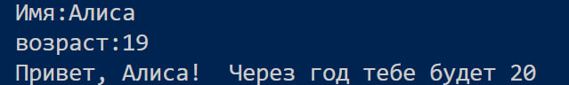

## Задание 2
```py
a = input("a: ")
cleaned_string = a.replace(",", ".")
float_a = float(cleaned_string)
b = float(input("b:"))
print("sum=", float_a + b, ";", "avg=", round(((float_a + b) / 2), 2))
```
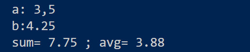
## Задание 3
```py
price = float(input())
discount = float(input())
vat = float(input())
base = price * (1 - discount/100)
vat_amount = base * (vat/100)
total = base + vat_amount
print('База после скидки: 'f'{base:.2f}''₽')
print('НДС: 'f'{vat_amount:.2f}''₽')
print('Итого к оплате: 'f'{total:.2f}''₽')
```
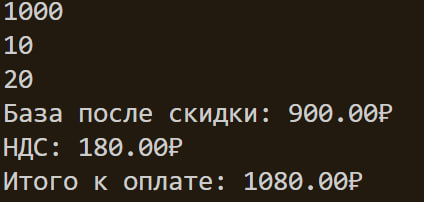
## Задание 4
```py
m = int(input('Минуты: '))
hours = m//60
minute = m%60
print(f'{hours}:{minute:02d}')
```

## Задание 5
```py
FIO = input('ФИО: ').split()
answer = ''
for i in range(len(FIO)):
    answer+= FIO[i][0] 
fio_with_spaces = ' '.join(FIO)
length = len(fio_with_spaces)
print('Инициалы:', answer+'.')
print('Длина (символов):', length)
```
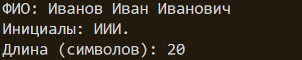
## Задание 6
```py
N = int(input('Количество студентов: '))
count_true = 0
count_false = 0
for i in range(N):
    data = input().split()
    format = data[3]
    if format == 'True':
        count_true += 1
    else: count_false += 1
print('очно/заочно:', count_true, count_false)
```
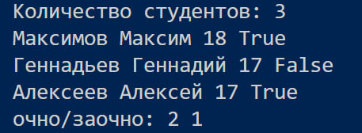

# Лабораторная работа 2
## Задание 1
### №1 min_max
```py
array1 = [3, -1, 5, 5, 0]
array2 = [42]
array3 = [-5, -2, -9]
array4 = [1.5, 2, 2.0, -3.1]
array5=[]
def min_max(nums: list[float | int]):
    n =[a for a in nums]
    if len(n)!=0:
        return min(n),max(n)
    if len(n)==0:
        raise ValueError
print(min_max(array1))
print(min_max(array2))
print(min_max(array3))
print(min_max(array4))
print(min_max(array5))
```
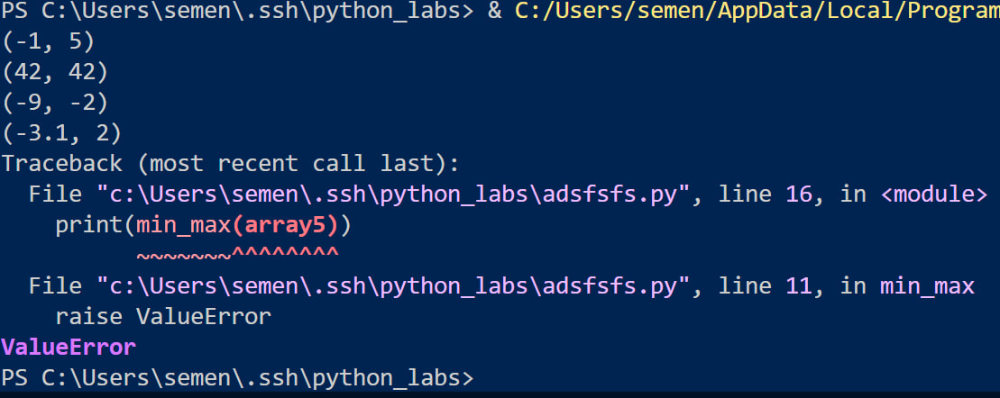
### №2 unique_sorted
```py
array1 = [3, 1, 2, 1, 3]
array2 = [-1, -1, 0, 2, 2]
array3 = [1.0, 1, 2.5, 2.5, 0]
array4=[]
def unique_sorted(nums: list[float | int]):
    return sorted(set(nums))
print(unique_sorted(array1), unique_sorted(array2), unique_sorted(array3),unique_sorted(array4))
```
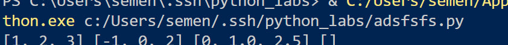
### №3 flatten
```py
array1 = [[1, 2], [3, 4]]
array2 = [[1, 2], (3, 4, 5)]
array3 = [[1], [], [2, 3]]
array4=[[1, 2], "ab"]
def flatten(mat: list[list | tuple]):
    answer = []
    for n in mat:
        if isinstance(n,list) or isinstance(n,tuple):
            for y in n:
                answer += [y]
        else:
            raise TypeError
    return answer
  
print(flatten(array1))
print(flatten(array2))
print(flatten(array3))
print(flatten(array4))
```
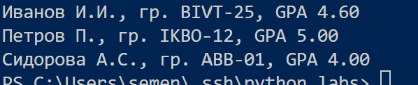
## Задание 2
### №1 transpose
```py
def transpose(mat: list[list[float | int]]):
    res=[list(x) for x in zip(*mat)]
    for row in mat:
        if len(mat[0])!=len(row):
            raise ValueError
    return res
array1=[[1,2,3]]
array2=[[1],[2],[3]]
array3=[[1,2],[3,4]]
array4=[]
array5=[[1, 2], [3]]
print(transpose(array1))
print(transpose(array2))
print(transpose(array3))
print(transpose(array4))
print(transpose(array5))
```
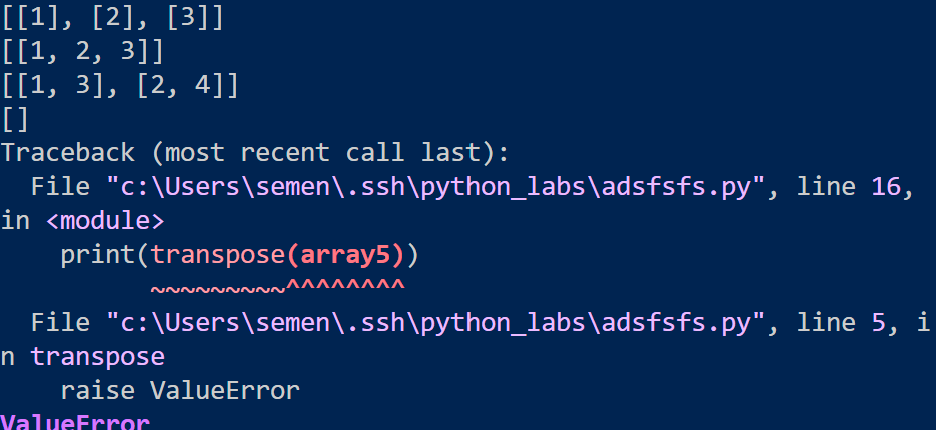
### №2 row_sums
```py
array1=[[1,2,3],[4,5,6]]
array2=[[-1,1],[10,-10]]
array3=[[0, 0], [0, 0]]
array4=[[1, 2], [3]]
def row_sums(mat: list[list[float or int]]) -> list[float]:

    for row in mat:
        if len(mat[0]) != len(row):
            raise ValueError
        
    res = [sum(row) for row in mat]

    return res
print(row_sums(array1))
print(row_sums(array2))
print(row_sums(array3))
print(row_sums(array4))
```
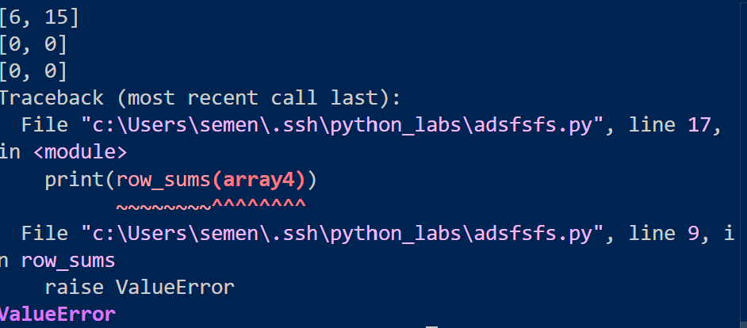
### №3 col_sums
```py
array1=[[1,2,3],[4,5,6]]
array2=[[-1,1],[10,-10]]
array3=[[0,0],[0,0]]
array4=[[1, 2], [3]]
def col_sums(mat: list[list[float | int]]) -> list[float]:

    for row in mat:
        if len(mat[0]) != len(row):
            raise ValueError

    res = [sum(row) for row in zip(*mat)]

    return res
print(col_sums(array1))
print(col_sums(array2))
print(col_sums(array3))
print(col_sums(array4))
```
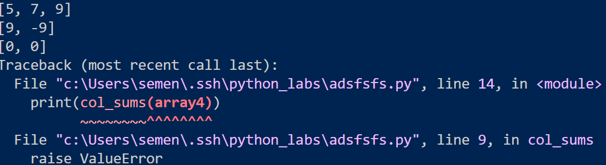
## Задание 3
```py
def format_record(rec: tuple[str, str, float]) -> str:

    fio, group, gpa = rec

    if not isinstance(fio, str) or not fio.strip():
        raise ValueError
    
    if not isinstance(group, str) or not group.strip():
        raise ValueError
    
    if not isinstance(gpa, (int, float)):
        raise TypeError

    cleanned_fio = ' '.join(fio.split())

    fio_parts = cleanned_fio.split()

    if len(fio_parts) < 2:
        raise ValueError    
    
    surname = fio_parts[0].title()

    initials = []

    for name_part in fio_parts[1:]:
        if name_part.strip():
            initial = name_part[0].upper() + '.'
            initials.append(initial)

    if len(initials) > 2:
        initials = initials[:2]

    formatted_fio = f"{surname} {''.join(initials)}"

    cleaned_group = group.strip()

    formatted_gpa = f"{gpa:.2f}"

    return f"{formatted_fio}, гр. {cleaned_group}, GPA {formatted_gpa}"

student1 = ("Иванов Иван Иванович", "BIVT-25", 4.6)
student2 = ("Петров Пётр", "IKBO-12", 5.0)
student3 = ("Петров Пётр Петрович", "IKBO-12", 5.0)
student4 = ("  сидорова  анна   сергеевна ", "ABB-01", 3.999)

print(format_record(student1))
print(format_record(student2))
print(format_record(student3))
print(format_record(student4))
```
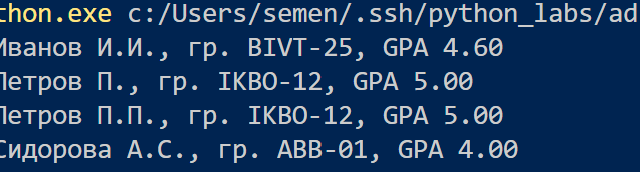

#Лабараторная работа №3
## Задание A — src/lib/text.py
### Normalize
```py
import re
def normalize(text: str, *, casefold: bool = True, yo2e: bool = True): 
    if casefold:
        text = text.casefold()
    if yo2e:
        text = text.replace('ё', 'е').replace('Ё', 'Е')
    
    pattern= (r'[^\s]+')
    normalized = []
    for match in re.finditer(pattern, text):
        normalized.append(match.group())

    return ' '.join(normalized).strip()

test_cases = ["ПрИвЕт\nМИр\t","ёжик, Ёлка","Hello\r\nWorld","  двойные   пробелы  "]
for test in test_cases:
    result=normalize(test)
    print(result)
```
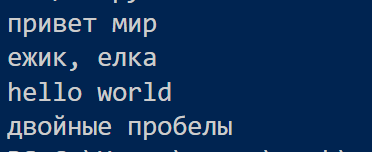
### Tokenize
```py
import re
def tokenize(text: str) -> list[str]:
    pattern = (r'[\w-]+')
    tokens = []
    for match in re.finditer(pattern , text):
        tokens.append(match.group())

    return tokens
test_cases = ["привет мир", "hello,world!!!", "по-настоящему круто", "2025 год", "emoji 😀 не слово"]
for test in test_cases:
    result = tokenize(test)
    print(result)
```
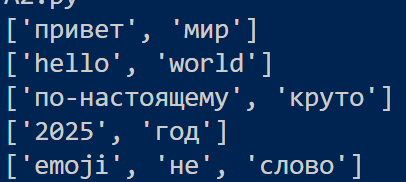
### count_freq+top_n
```py
def count_freq(tokens: list[str]):
    d = {}
    for word in tokens:
        d[word] = d.get(word, 0) + 1
    return d
test1 = ["a","b","a","c","b","a"]
print(count_freq (test1))

def top_n(freq: dict[str, int], n: int = 5) -> list[tuple[str, int]]:
    d = {}
    for word in freq:
        d[word] = d.get(word, 0) + 1
    return sorted(d.items(),key=lambda x:(x[1]))[::-1]
test1 = ["bb","aa","bb","aa","cc"]
print( top_n(test1))
```
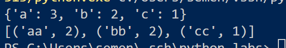
## Задание B — src/text_stats.py (скрипт со stdin)
```py
import sys
from lib import text
line  = sys.stdin.readline()
tokenized = text.tokenize(line)
unique_words = text.top_n(tokenized)
result = text.count_freq(unique_words)
print(f"Всего слов: {len(tokenized)}")
print(f"Уникальных слов: {len(unique_words)}")
print('top-5:')
for string in result:
    print(f'{string[0]}:{string[1]}')
```
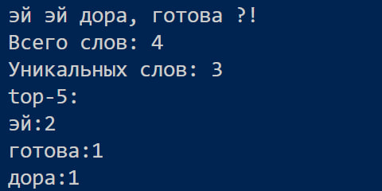
# Лабараторная работа №4
## Функции реализованные для работы с текстом:
### io_text_csv
```py
from pathlib import Path
import csv

def read_text(path: str | Path, encoding: str = "utf-8") -> str:
    p = Path(path)
    if not p.exists():
        raise FileNotFoundError(f"Файл не найден: {p}")
    return p.read_text(encoding=encoding)

def write_csv(
    rows: list[tuple | list], path: str | Path, header: tuple[str, ...] | None = None
) -> None:
    p = Path(path)
    if p.suffix.lower() != ".csv":
        raise ValueError
    if rows:
        first_length = len(rows[0])
        for i, row in enumerate(rows):
            if len(row) != first_length:
                raise ValueError(f"ошибка")

    with p.open("w", newline="", encoding="utf-8") as f:
        writer = csv.writer(f)

        if header is not None:
            writer.writerow(header)
        for row in rows:
            writer.writerow(list(row))
```
### text.py
```py
from re import *
def tokenize(text):
    pattern = (r'[a-zA-Zа-яА-ЯёЁ0-9]+([-][a-zA-Zа-яА-ЯёЁ0-9]+)*')
    tokens = []
    for match in finditer(pattern,text):
        tokens.append(match.group())
    return tokens

import re
def normalize(text: str, *, casefold: bool = True, yo2e: bool = True): 
    if casefold:
        text = text.casefold()
    if yo2e:
        text = text.replace('ё', 'е').replace('Ё', 'Е')
    pattern= (r'[a-zA-Zа-яА-ЯёЁ0-9]+([-][a-zA-Zа-яА-ЯёЁ0-9]+)*')
    normalized = []
    for match in re.finditer(pattern, text):
        normalized.append(match.group())
    return ' '.join(normalized).strip()

def count_freq(tokens: list[str]):
    d={x:tokens.count(x) for x in set(tokens)}
    return sorted(d.items(),key=lambda x:-x[1])

from collections import * 

def frequencies_from_text(text: str) -> dict[str, int]:
    tokens=tokenize(normalize(text))
    return Counter(tokens)

def sorted_word_counts(freq: dict[str, int]) -> list[tuple[str, int]]:
    return sorted(freq.items(),key=lambda x: (-x[1],x[0]))
```
### Задание A
```py
import sys
from pathlib import Path

current_file = Path(__file__)
print(f"Текущий файл: {current_file}")

parent_dir = current_file.parent.parent
sys.path.append(str(parent_dir))

from lib.io_txt_csv import read_text, write_csv

result = read_text("src/data/input.txt")
test = [("привет", 3), ("пока", 3)]
write_csv(test, "src/data/test.csv", header=("word", "count"))
```
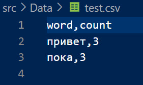
### Задание B
```py
from pathlib import *
import sys 
current_file = Path(__file__)
print(f"Текущий файл: {current_file}")

parent_dir = current_file.parent.parent
sys.path.append(str(parent_dir))
from lib.io_txt_csv import read_text, write_csv
from lib.text import frequencies_from_text, sorted_word_counts

input_file = "src/Data/input_test.txt" 
output_file = "src/Data/output.csv" 
encoding = "utf-8" 
input_path = Path(input_file)
output_path=Path(output_file)
if not input_path.exists():
    print(f"Ошибка: Файл '{input_file}' не найден.")
    print("Пожалуйста, проверьте правильность пути к файлу.")
else:
    try:
        file = read_text(input_file, encoding)
    except FileNotFoundError:
        print(f"Ошибка: Файл '{input_file}' не найден.")
        sys.exit(1)
    except UnicodeDecodeError:
        print(f"Ошибка декодирования: проверьте кодировку (сейчас encoding='{encoding}').")
        sys.exit(1)

    freq = frequencies_from_text(file)
    sorted_words = sorted_word_counts(freq)
        
    csv_rows = [[word, count] for word, count in sorted_words]
    csv_header = ('word', 'count')
    write_csv(csv_rows, output_path, csv_header)
    total_words = sum(freq.values())
    unique_words = len(freq)
    print(f"Всего слов: {total_words}")
    print(f"Уникальных слов: {unique_words}")
    print("Топ 5 самых частых слов:")
        
    top_5 = sorted_words[:5]
    if top_5:
        for i, (word, count) in enumerate(top_5):
            print(f"  {i+1}. '{word}': {count}")
```
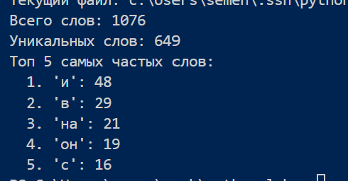
### текст  Лермонтова "В аптеке"
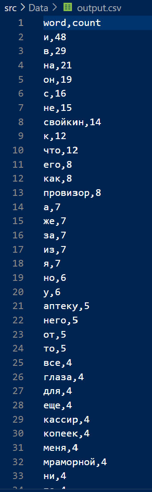